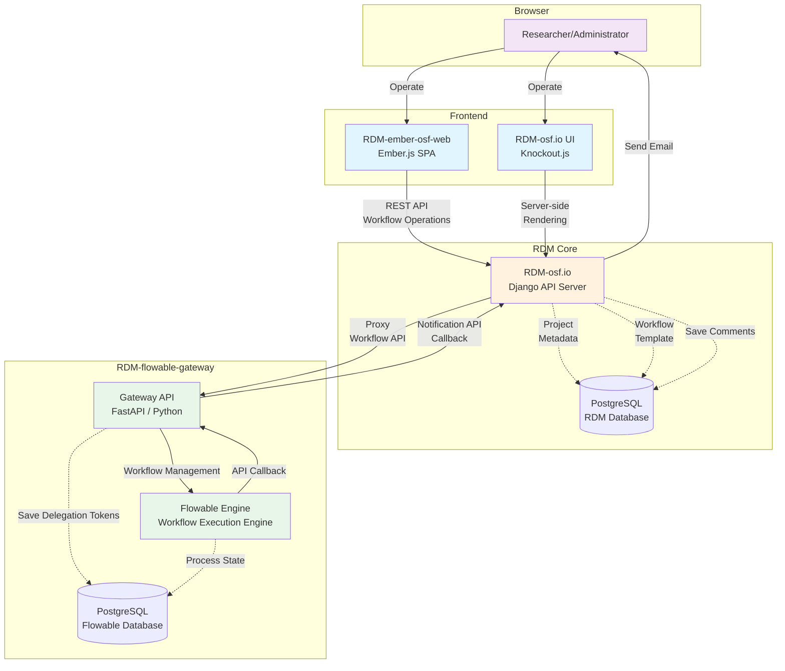

# Workflow Addon

## Architecture



### Components

**Frontend:**
- **RDM-ember-osf-web**: Modern Ember.js SPA for workflow operations
- **RDM-osf.io UI**: Server-side rendered pages with Knockout.js for project management

**RDM Core:**
- **RDM-osf.io**: Django-based API server managing projects, metadata, and workflow templates
- **PostgreSQL**: Stores project data, workflow templates, and comments

**RDM-flowable-gateway:**
- **Gateway API**: FastAPI-based proxy server managing delegation tokens and workflow lifecycle
- **Flowable Engine**: BPMN workflow execution engine
- **PostgreSQL**: Stores workflow process states, tasks, and encrypted delegation tokens

### Data Flow

1. **Start Workflow**: User → Ember → RDM-osf.io → Gateway → Flowable Engine
2. **Execute Process**: Flowable Engine → Flowable DB (saves process state)
3. **Send Notification**: Flowable Engine → Gateway API (HTTP Task) → RDM-osf.io → User (email)
4. **Token Management**: Gateway stores encrypted delegation tokens per process instance in a separate database table. This prevents tokens from being stored in Flowable process variables, where they could be easily accessed through the Flowable admin interface or REST API.

## Workflow Template Deployment

When a workflow template (ZIP file containing BPMN files) is deployed to the Flowable engine, the system automatically selects the appropriate process definition.

Workflow ZIP files can be downloaded from the Apps screen in Flowable Modeler.

### Process Definition Selection

If the ZIP contains multiple BPMN files (e.g., main process and sub-processes), you can specify which is the main process by using a specific process definition key prefix:

- **To designate the main process**: Set the process definition key (the `id` attribute in BPMN XML) starting with `rdm-main-`
- **If no `rdm-main-` prefix is found**: The first definition in the deployment is used

This allows you to explicitly indicate the main workflow process when your workflow ZIP contains multiple BPMN files.

**Example:**
- Process definition keys in ZIP: `rdm-main-approval`, `sub-review`, `sub-notify`
- System selects: `rdm-main-approval` (due to `rdm-main-` prefix)

## Notification Endpoint

Workflow engines send notifications to RDM users via email, project comments, and NodeLog:

```
POST /api/v1/project/<pid>/workflow/engines/<engine_id>/runs/<process_instance_id>/notifications/
```

Requires Personal Access Token in Authorization header.

### Request Body

```json
{
  "title": "Task assigned",
  "body": [
    {
      "type": "text/plain",
      "content": "Please review the document"
    },
    {
      "type": "text/html",
      "content": "<p>Please review the document</p>"
    }
  ],
  "assignees": ["executor", "manager"],
  "send_email": true,
  "add_comment": false
}
```

- `title` (required): Notification title
- `body` (required): Array of body content with `type` and `content` fields
  - `text/plain` (required): Plain text content for NodeLog and comments
  - `text/html` (optional): HTML content for email display
- `assignees`: Role-based assignees - `"executor"`, `"manager"`, `"creator"`, `"contributor"`
- `user_ids`: Specific OSF user IDs
- `send_email`: Send email (default: false)
- `add_comment`: Add as project comment (default: false)

### Assignee Resolution

- `executor`: User who started the run (from `_RDM_WORKFLOW_METADATA.started_by`)
- `manager`: User who activated the workflow on this project
- `creator`: User who created the workflow template
- `contributor`: All project contributors

### Response

```json
{
  "message": "Notification sent",
  "recipients": ["user1_id", "user2_id"]
}
```

### NodeLog Action

Notifications are logged with action type: `workflow_notification`

## Flowable Http Task Example

To send a notification from a Flowable workflow, use an Http Task with the following configuration:

```json
{
  "url": "${RDM_EXECUTOR_WEB_URL}/api/v1/project/${RDM_NODE_ID}/workflow/engines/${RDM_ENGINE_ID}/runs/${execution.processInstanceId}/notifications/",
  "httpMethod": "POST",
  "headers": {
    "Content-Type": "application/json"
  },
  "requestBody": {
    "title": "Task assigned",
    "body": [
      {
        "type": "text/plain",
        "content": "Please review the document"
      },
      {
        "type": "text/html",
        "content": "<p>Please review the document</p>"
      }
    ],
    "assignees": ["executor", "manager"],
    "send_email": true,
    "add_comment": false
  }
}
```

**Variables used:**
- `${RDM_EXECUTOR_WEB_URL}` - Gateway proxy URL for executor token
- `${RDM_NODE_ID}` - Project ID
- `${RDM_ENGINE_ID}` - Engine ID
- `${execution.processInstanceId}` - Current process instance ID

**Important:** When registering the workflow, the Executor token must be set to "Use with Read permission" or "Use with ReadWrite permission". If set to "Do not use", the `RDM_EXECUTOR_WEB_URL` variable will not be available and the notification endpoint cannot be called.

You can also use `RDM_CREATOR_WEB_URL` or `RDM_MANAGER_WEB_URL` depending on which delegation token should be used for authentication.

**Note:** No `Authorization` header is needed - the Gateway automatically adds the delegation token.

## Lifecycle Management

### Component Hierarchy

```
WorkflowEngine
  └── WorkflowTemplate (1:N)
        └── WorkflowActivation (1:N)
              └── Process Instance (1:N)
```

### States and Transitions

```
[Active] ←─(activate)─→ [Inactive] ──(delete)──→ [Deleted]
```

| State | Description | Transition to next |
|-------|-------------|-------------------|
| **Active** | All operations permitted | Deactivate: always allowed |
| **Inactive** | New activities prohibited, existing data accessible, running process instances continue | Activate: always allowed, Delete: see conditions below |
| **Deleted** | Permanently removed with all dependents (cascade delete) | - |

### Prohibited Activities when Inactive

| Component | Prohibited |
|-----------|------------|
| Engine | New template registration |
| Template | New activation creation |
| Activation | New process instance start |

### Delete Conditions

Deletion is only allowed from the Inactive state.

Each process instance has a `business_key` in the format: `rdm:node:{node_id}:activation:{activation_id}`. A process instance is considered **running** if it exists in Flowable with `endTime = null`.

| Component | Can be deleted when... |
|-----------|------------------------|
| Activation | No process instances with matching `activation:{id}` in business_key have `endTime = null` in Flowable |
| Template | All its activations can be deleted |
| Engine | All its templates can be deleted |

On deletion, all dependent components are cascade-deleted.
